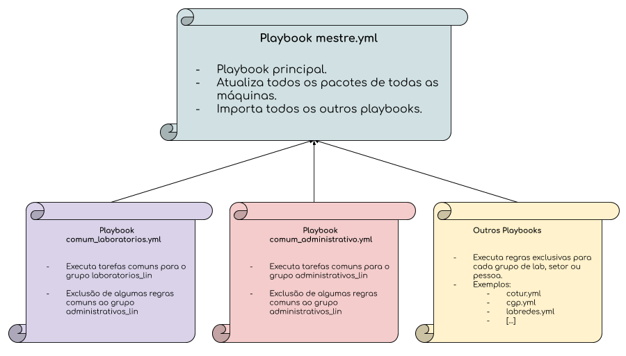
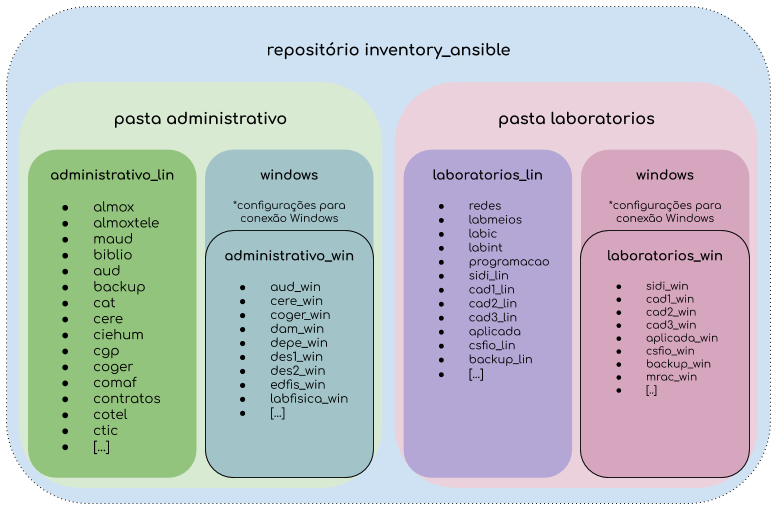

# Ansible

Utilizamos o Ansible para gerenciamento de configuração do parque de máquina e infraestrutura do Câmpus. 

Uma visão geral do repositório com relação a organização dos playbooks é encontrada na figura a seguir:

Possuimos também nesse repositório [playbooks](servidores) para gerenciamento de configuração (IaC) dos nossos servidores.

O repositório [gitlab.com/ctic-sje-ifsc/inventory_ansible](https://gitlab.com/ctic-sje-ifsc/inventory_ansible) (privado) contém os arquivos de inventário do Câmpus. A figura a seguir representa a divisão dos grupos:

